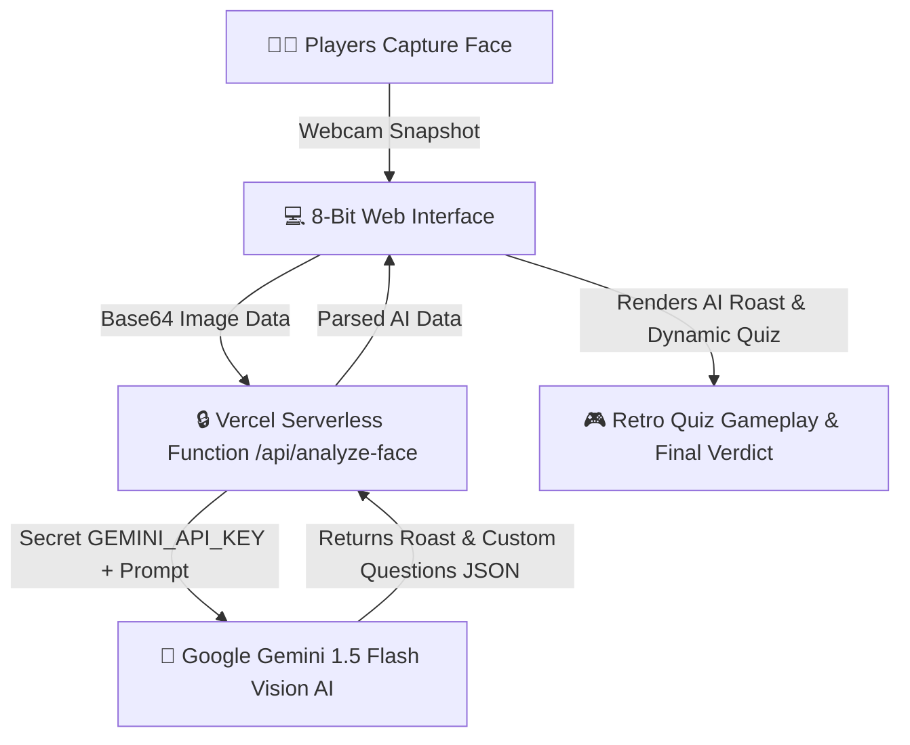

# Who Is More Useless? 🎯

## Basic Details
### Team Name: Useless Legends

### Team Members
- Team Lead: Hafiz Azeez - College of Engineering

### Project Description
*Who Is More Useless?* is the ultimate retro 8-bit arcade adventure game where two players compete face-to-face to determine who is scientifically more useless! Powered by **Google Gemini 1.5 Flash Multimodal Vision AI**, the game captures players' faces via webcam, roasts their expressions in 100% retro Kerala Manglish, and dynamically generates custom quiz questions tailored to their face vibe.

### The Problem (that doesn't exist)
Friends and roommates constantly argue about who is more useless and wastes more time in life, but they lack scientific AI facial analysis, retro coin sounds, and an emergency court objection system to prove it.

### The Solution (that nobody asked for)
An AI-powered 8-bit retro arcade experience! Players scan their faces via webcam while **Gemini 1.5 Flash AI** analyzes their facial expression, delivers custom Manglish face roasts, generates personalized quiz questions on the fly, and calculates their final Uselessness Scorecard with emergency court alerts and retro coin explosions!

## Technical Details
### Technologies/Components Used
For Software:
- **Languages**: HTML5, CSS3, JavaScript (ES6+)
- **AI Engine**: Google Gemini 1.5 Flash Multimodal Vision API
- **Backend / Serverless**: Vercel Serverless Functions (`/api/analyze-face.js`)
- **Audio Engine**: Web Audio API (Synthesized 8-bit Retro Chiptunes)
- **Design System**: Vanilla CSS3, Glassmorphism, Google Fonts (`Press Start 2P`, `Outfit`)

For Hardware:
- Standard Webcam (for Gemini AI Face Scanning)
- Computer / Smartphone Display

### Implementation
For Software:

# Installation
```bash
git clone https://github.com/hafizazeez111-sudo/useless_project_temp.git
cd useless_project_temp
```

# Run
```bash
# Open index.html in any modern browser, or run locally via Vercel:
npx vercel dev
```

### Project Documentation
For Software:

# Screenshots

*Screen 1: Retro 8-bit Landing Screen with Manglish Hero Quote*


*Screen 2: Gemini 1.5 Flash AI Face Scanner & Live Expression Roast*


*Screen 3: Dynamic AI Quiz Gameplay with Turn Spotlight & Coin Explosion*

# Diagrams

*System Workflow: Face Capture -> Vercel Serverless Proxy -> Gemini 1.5 Flash AI -> Retro Quiz & Roast Verdict*

### Project Demo
# Video
[Live Web Application](https://useless-project-temp.vercel.app/)
*Live Interactive Demo: Test your face uselessness in real-time!*

# Additional Demos
- [GitHub Repository](https://github.com/hafizazeez111-sudo/useless_project_temp)

## Team Contributions
- Hafiz Azeez: Concept design, Retro 8-bit UI/UX, Web Audio API synthesizer
- Thamir: Gemini 1.5 Flash AI Integration, Vercel Serverless Proxy setup.

---
Made with ❤️ at TinkerHub Useless Projects 


